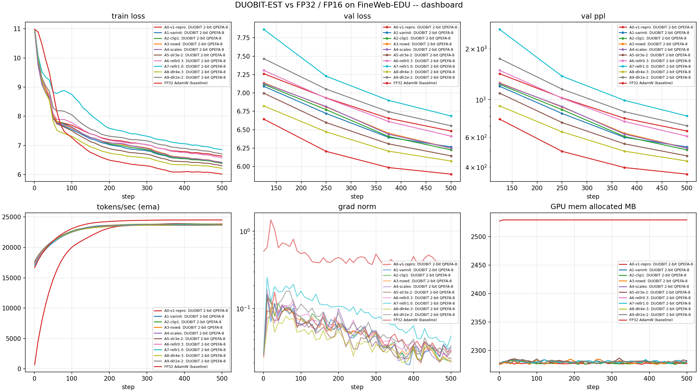
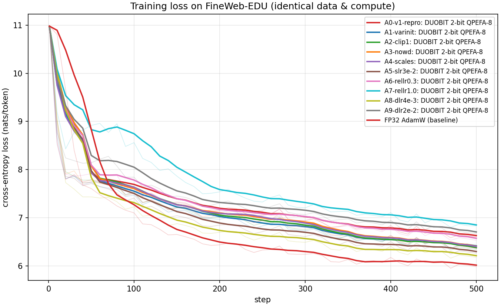
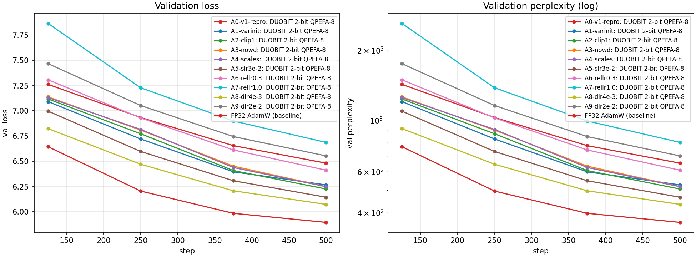
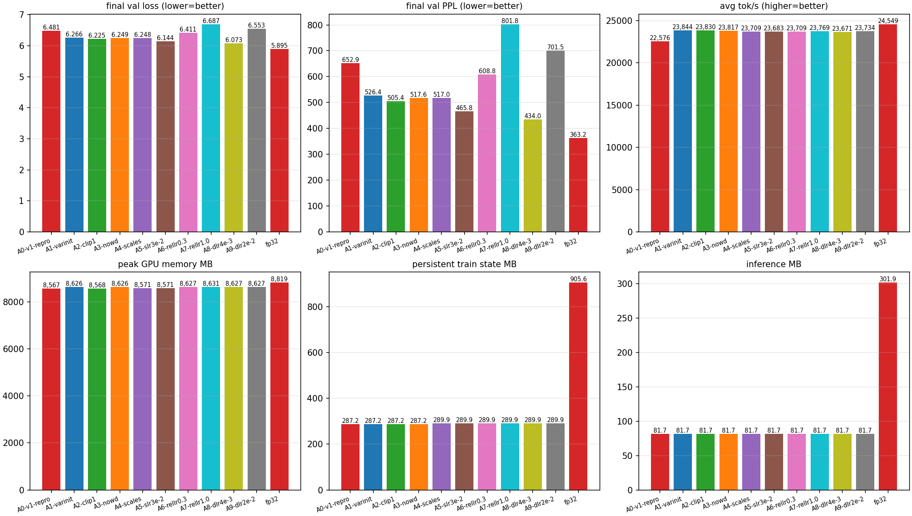
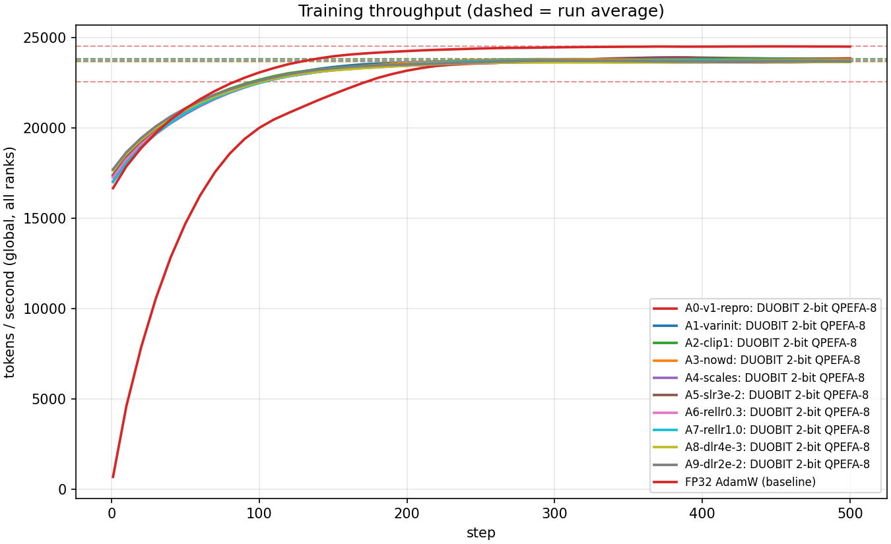
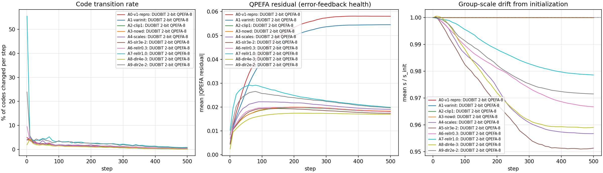
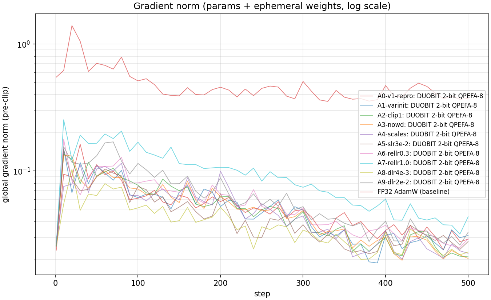
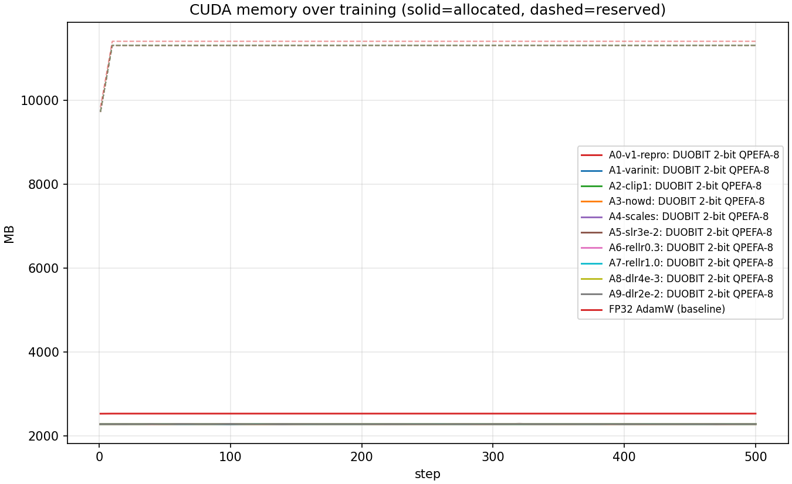
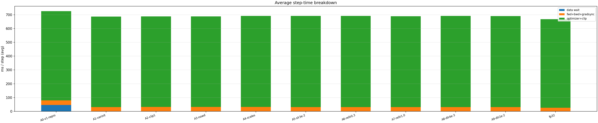
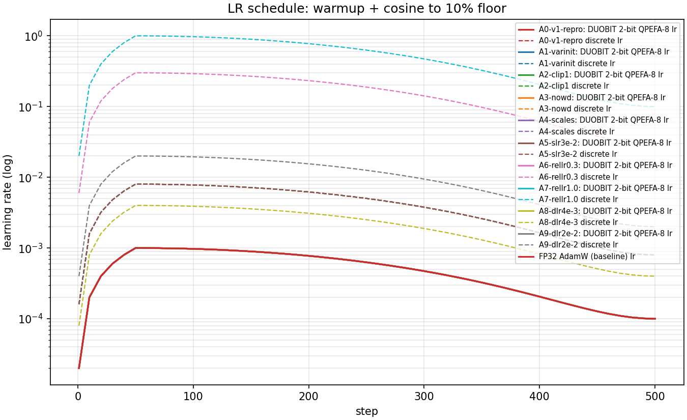

# DUOBIT-EST vs FP32 / FP16 on FineWeb-EDU (script v1.0.0)

Generated 2026-08-30 16:59:01 UTC.

**Hardware**: Tesla T4 (14.6 GB, cc 7.5), Tesla T4 (14.6 GB, cc 7.5) | torch 2.10.0+cu128 | python 3.12.13

## 1. Setup

- Architecture: 6-layer decoder, d_model 384, 6 heads, SwiGLU d_ff 1024, RMSNorm, RoPE, causal SDPA
- Data: `HuggingFaceFW/fineweb-edu` config `sample-100BT`, GPT-2 tokenizer, streamed; held-out validation of 32,768 tokens/rank from files disjoint from training
- Budget per run: 500 steps, batch 16/GPU x 512 tokens, seed 1337
- DuoBIT: 2-bit (4-level) codebook (rho=0.3333), group size 128, QPEFA 8-bit (clip 1.0), first moment 8-bit block-wise, factored second moment
- Every run consumes the identical token stream (same seed, same rank file assignment), so the comparison is same-data and same-compute.

### Runs

| run | mode | configuration |
|---|---|---|
| A0-v1-repro | duobit | learn_scales=0, scale_lr=0.001, rel_lr=0, duobit_lr=0.008, clip=4.0, wd=0.01 |
| A1-varinit | duobit | learn_scales=0, scale_lr=0.001, rel_lr=0, duobit_lr=0.008, clip=4.0, wd=0.01 |
| A2-clip1 | duobit | learn_scales=0, scale_lr=0.001, rel_lr=0, duobit_lr=0.008, clip=1.0, wd=0.01 |
| A3-nowd | duobit | learn_scales=0, scale_lr=0.001, rel_lr=0, duobit_lr=0.008, clip=1.0, wd=0.0 |
| A4-scales | duobit | learn_scales=1, scale_lr=0.01, rel_lr=0, duobit_lr=0.008, clip=1.0, wd=0.0 |
| A5-slr3e-2 | duobit | learn_scales=1, scale_lr=0.03, rel_lr=0, duobit_lr=0.008, clip=1.0, wd=0.0 |
| A6-rellr0.3 | duobit | learn_scales=1, scale_lr=0.01, rel_lr=1, duobit_lr=0.3, clip=1.0, wd=0.0 |
| A7-rellr1.0 | duobit | learn_scales=1, scale_lr=0.01, rel_lr=1, duobit_lr=1.0, clip=1.0, wd=0.0 |
| A8-dlr4e-3 | duobit | learn_scales=1, scale_lr=0.01, rel_lr=0, duobit_lr=0.004, clip=1.0, wd=0.0 |
| A9-dlr2e-2 | duobit | learn_scales=1, scale_lr=0.01, rel_lr=0, duobit_lr=0.02, clip=1.0, wd=0.0 |
| fp32 | fp32 | lr=0.001, wd=0.01, amp=False |

## 2. Results

| metric | A0-v1-repro | A1-varinit | A2-clip1 | A3-nowd | A4-scales | A5-slr3e-2 | A6-rellr0.3 | A7-rellr1.0 | A8-dlr4e-3 | A9-dlr2e-2 | fp32 |
|---|---|---|---|---|---|---|---|---|---|---|---|
| final val loss | 6.4814 | 6.2660 | 6.2254 | 6.2492 | 6.2481 | 6.1438 | 6.4114 | 6.6869 | 6.0731 | 6.5532 | 5.8948 |
| final val PPL | 652.85 | 526.39 | 505.40 | 517.61 | 517.01 | 465.83 | 608.76 | 801.80 | 434.01 | 701.45 | 363.15 |
| best val loss | 6.4814 | 6.2660 | 6.2254 | 6.2492 | 6.2481 | 6.1438 | 6.4114 | 6.6869 | 6.0731 | 6.5532 | 5.8948 |
| final train loss | 6.6002 | 6.3859 | 6.3380 | 6.3646 | 6.3627 | 6.2642 | 6.5293 | 6.8309 | 6.1764 | 6.6735 | 5.9808 |
| tokens seen | 8,192,000 | 8,192,000 | 8,192,000 | 8,192,000 | 8,192,000 | 8,192,000 | 8,192,000 | 8,192,000 | 8,192,000 | 8,192,000 | 8,192,000 |
| wall time (min) | 6.5 | 5.8 | 5.8 | 5.8 | 5.8 | 5.8 | 5.8 | 5.8 | 5.8 | 5.8 | 5.6 |
| avg tok/s | 22,576 | 23,844 | 23,830 | 23,817 | 23,709 | 23,683 | 23,709 | 23,769 | 23,671 | 23,734 | 24,549 |
| peak GPU mem (MB) | 8,567 | 8,626 | 8,568 | 8,626 | 8,571 | 8,571 | 8,627 | 8,631 | 8,627 | 8,627 | 8,819 |

### Persistent state and precision

| metric | A0-v1-repro | A1-varinit | A2-clip1 | A3-nowd | A4-scales | A5-slr3e-2 | A6-rellr0.3 | A7-rellr1.0 | A8-dlr4e-3 | A9-dlr2e-2 | fp32 |
|---|---|---|---|---|---|---|---|---|---|---|---|
| linear train bits/weight | 18.60 | 18.60 | 18.60 | 18.60 | 19.35 | 19.35 | 19.35 | 19.35 | 19.35 | 19.35 | 96.00 |
| linear inference bits/weight | 2.25 | 2.25 | 2.25 | 2.25 | 2.25 | 2.25 | 2.25 | 2.25 | 2.25 | 2.25 | 32.00 |
| persistent train state (MB) | 287.2 | 287.2 | 287.2 | 287.2 | 289.9 | 289.9 | 289.9 | 289.9 | 289.9 | 289.9 | 905.6 |
| inference footprint (MB) | 81.7 | 81.7 | 81.7 | 81.7 | 81.7 | 81.7 | 81.7 | 81.7 | 81.7 | 81.7 | 301.9 |
| train compression vs FP32 | 1.96 | 1.96 | 1.96 | 1.96 | 1.94 | 1.94 | 1.94 | 1.94 | 1.94 | 1.94 | 1.00 |
| inference compression vs FP32 | 2.30 | 2.30 | 2.30 | 2.30 | 2.30 | 2.30 | 2.30 | 2.30 | 2.30 | 2.30 | 1.00 |

Persistent training state counts what must be held for the whole run: for DuoBIT the 2-bit codes, the FP32 group scales, the int8 QPEFA residual, the block-wise int8 first moment and the factored second moment (plus two FP32 Adam moments per group when the scales are trained); for FP32 and FP16 the FP32 weight plus both FP32 Adam moments (96 bits/weight -- mixed precision keeps FP32 master weights, so only its inference export halves). Embeddings and norm gains are FP32 in every regime and are included in both totals.

### DuoBIT training dynamics

| metric | A0-v1-repro | A1-varinit | A2-clip1 | A3-nowd | A4-scales | A5-slr3e-2 | A6-rellr0.3 | A7-rellr1.0 | A8-dlr4e-3 | A9-dlr2e-2 | fp32 |
|---|---|---|---|---|---|---|---|---|---|---|---|
| mean code transition rate | 0.01202 | 0.01108 | 0.01295 | 0.01331 | 0.01517 | 0.01392 | 0.01445 | 0.03468 | 0.01002 | 0.02650 | n/a |
| mean |QPEFA residual| | 0.049501 | 0.045947 | 0.018162 | 0.018336 | 0.020048 | 0.017790 | 0.018554 | 0.023651 | 0.016261 | 0.022367 | n/a |
| final scale / init scale | 1.000 | 1.000 | 1.000 | 1.000 | 0.957 | 0.951 | 0.967 | 0.979 | 0.959 | 0.972 | n/a |
| mean grad norm | 0.0542 | 0.0524 | 0.0535 | 0.0524 | 0.0514 | 0.0472 | 0.0583 | 0.0975 | 0.0396 | 0.0673 | 0.4848 |
| code drift failures across ranks | 0 | 0 | 0 | 0 | 0 | 0 | 0 | 0 | 0 | 0 | 0 |

### Quality gap to the FP32 baseline

| run | val loss delta | PPL ratio | throughput ratio |
|---|---|---|---|
| A0-v1-repro | 0.5865 | 1.80x | 0.920 |
| A1-varinit | 0.3712 | 1.45x | 0.971 |
| A2-clip1 | 0.3305 | 1.39x | 0.971 |
| A3-nowd | 0.3544 | 1.43x | 0.970 |
| A4-scales | 0.3532 | 1.42x | 0.966 |
| A5-slr3e-2 | 0.2490 | 1.28x | 0.965 |
| A6-rellr0.3 | 0.5166 | 1.68x | 0.966 |
| A7-rellr1.0 | 0.7920 | 2.21x | 0.968 |
| A8-dlr4e-3 | 0.1782 | 1.20x | 0.964 |
| A9-dlr2e-2 | 0.6583 | 1.93x | 0.967 |

## 3. Samples

**A0-v1-repro** (greedy, prompt `Once upon a time`):

```text
Once upon a time of the first.
The first of the first of the first of the first of the first of the first of the first of the first of the first of the first of the world of the first of the world of the first of the
```

**A1-varinit** (greedy, prompt `Once upon a time`):

```text
Once upon a time.
The first time is a new way to the first time, the first, and the first time to the most of the first time.
The first time that the most of the first time, the first, and the first time
```

**A2-clip1** (greedy, prompt `Once upon a time`):

```text
Once upon a time.
The first step of the first, and the first of the first, and the first of the first, and the first of the first, and the first of the first, and the first of the first of the first of the
```

**A3-nowd** (greedy, prompt `Once upon a time`):

```text
Once upon a time.
The first is a new study of the world, and the first of the world.
The first of the first of the world is a new and the first of the world.
The first few years of the first of the
```

**A4-scales** (greedy, prompt `Once upon a time`):

```text
Once upon a time.
The first time is a few years of the first time in the world is a few years of the world.
The first time of the world is a few years of the first time.
The first time, the first time
```

**A5-slr3e-2** (greedy, prompt `Once upon a time`):

```text
Once upon a time.
The first is a few years ago, the first time is a few years of the first time.
The first time is a few years, and the first time of the first time of the first time.
The first time
```

**A6-rellr0.3** (greedy, prompt `Once upon a time`):

```text
Once upon a time of the world.
The first of the first time of the world is a few of the world.
The first is a few of the world.
The first is a few of the first time of the world.
The first
```

**A7-rellr1.0** (greedy, prompt `Once upon a time`):

```text
Once upon a time of the first of the same time of the same time of the same way, and the same of the same of the world of the world of the world of the world of the world of the world of the world of the world of the
```

**A8-dlr4e-3** (greedy, prompt `Once upon a time`):

```text
Once upon a time.
The first time is a few years ago.
The first time is a new study of the world.
The first time is a new study of the
- The first of the
- The first time to the
-
```

**A9-dlr2e-2** (greedy, prompt `Once upon a time`):

```text
Once upon a time.
- The way to be a new of the first.
- The study is a few of the first, and the first, and the first time of the first time of the first, and the first time of the first time
```

**fp32** (greedy, prompt `Once upon a time`):

```text
Once upon a time, the first time, the first time, the first time, the first time, the first time, the first time, the first time, the first time, and the first time, the first time, the first time, the first
```

## 4. Figures




















