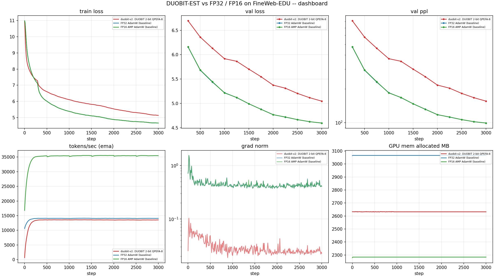
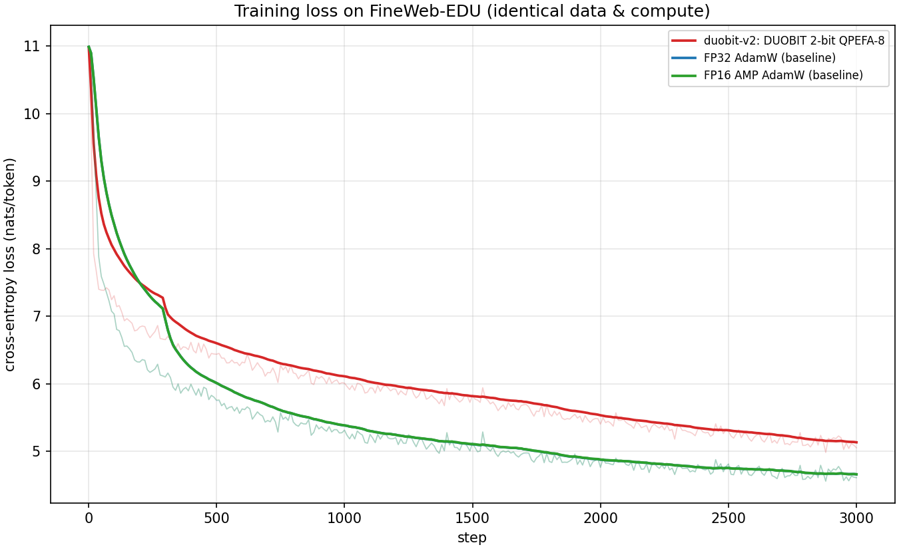
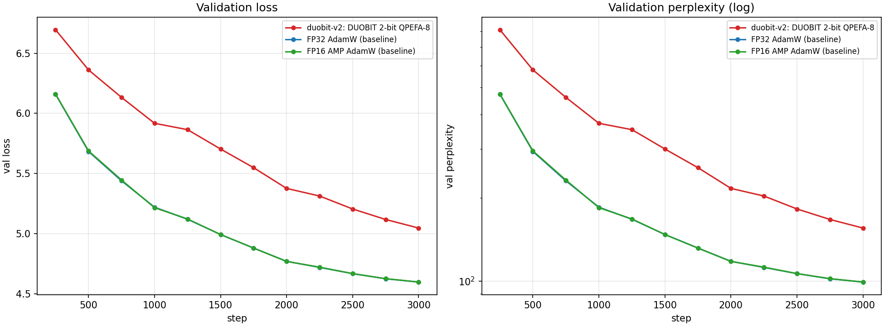
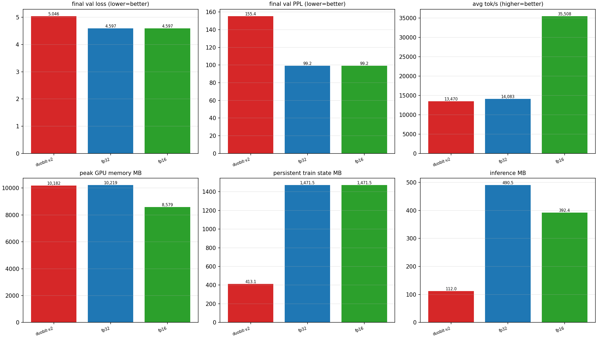
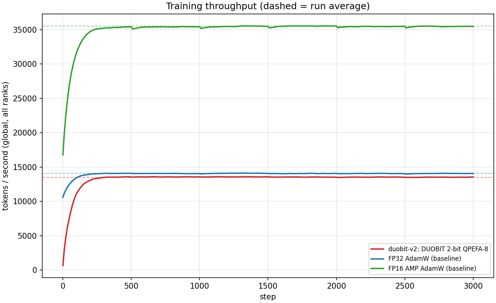
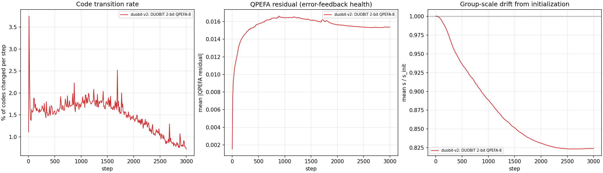
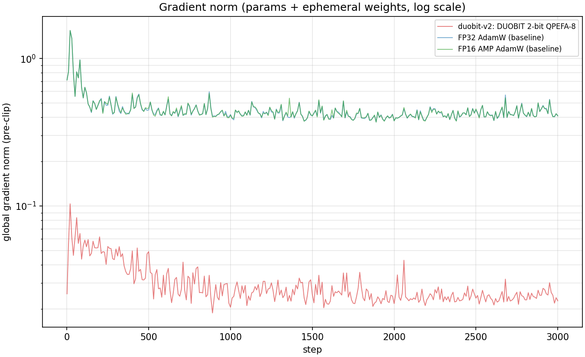
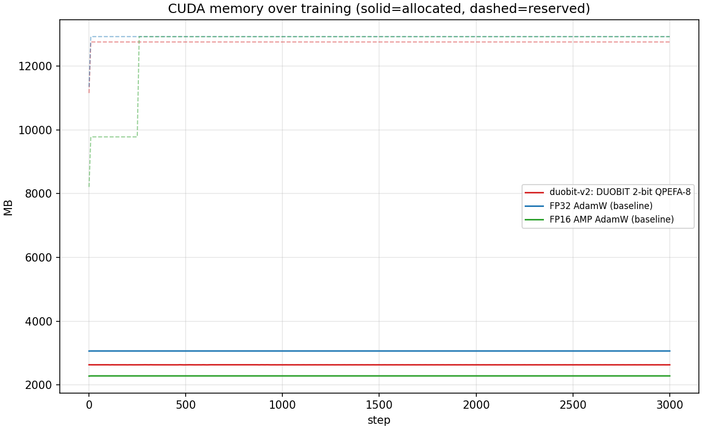
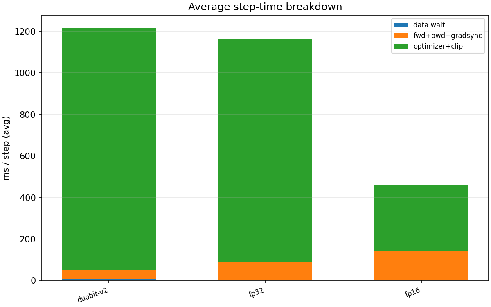
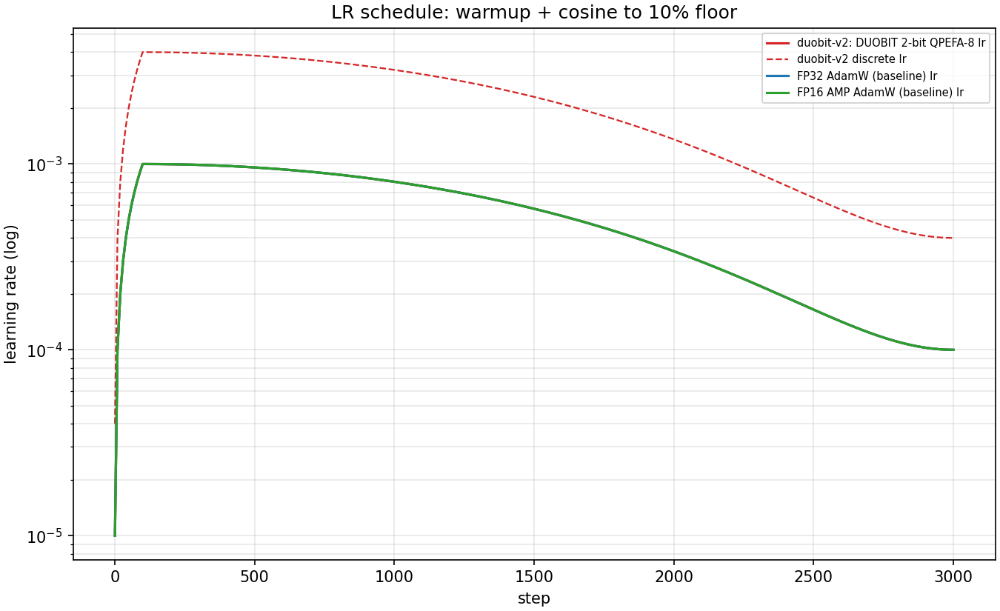

# DUOBIT-EST vs FP32 / FP16 on FineWeb-EDU (script v1.0.0)

Generated 2026-08-30 20:58:25 UTC.

**Hardware**: Tesla T4 (14.6 GB, cc 7.5), Tesla T4 (14.6 GB, cc 7.5) | torch 2.10.0+cu128 | python 3.12.13

## 1. Setup

- Architecture: 8-layer decoder, d_model 512, 8 heads, SwiGLU d_ff 1408, RMSNorm, RoPE, causal SDPA
- Data: `HuggingFaceFW/fineweb-edu` config `sample-100BT`, GPT-2 tokenizer, streamed; held-out validation of 131,072 tokens/rank from files disjoint from training
- Budget per run: 3,000 steps, batch 8/GPU x 1024 tokens, seed 1337
- DuoBIT: 2-bit (4-level) codebook (rho=0.3333), group size 128, QPEFA 8-bit (clip 1.0), first moment 8-bit block-wise, factored second moment
- Every run consumes the identical token stream (same seed, same rank file assignment), so the comparison is same-data and same-compute.

### Runs

| run | mode | configuration |
|---|---|---|
| duobit-v2 | duobit | learn_scales=1, scale_lr=0.01, rel_lr=0, duobit_lr=0.004, clip=1.0, wd=0.0 |
| fp32 | fp32 | lr=0.001, wd=0.01, amp=False |
| fp16 | fp16 | lr=0.001, wd=0.01, amp=True |

## 2. Results

| metric | duobit-v2 | fp32 | fp16 |
|---|---|---|---|
| final val loss | 5.0462 | 4.5968 | 4.5969 |
| final val PPL | 155.43 | 99.16 | 99.17 |
| best val loss | 5.0462 | 4.5968 | 4.5969 |
| final train loss | 5.0546 | 4.6124 | 4.6128 |
| tokens seen | 49,152,000 | 49,152,000 | 49,152,000 |
| wall time (min) | 62.3 | 59.4 | 24.3 |
| avg tok/s | 13,470 | 14,083 | 35,508 |
| peak GPU mem (MB) | 10,182 | 10,219 | 8,579 |

### Persistent state and precision

| metric | duobit-v2 | fp32 | fp16 |
|---|---|---|---|
| linear train bits/weight | 19.33 | 96.00 | 96.00 |
| linear inference bits/weight | 2.25 | 32.00 | 16.00 |
| persistent train state (MB) | 413.1 | 1,471.5 | 1,471.5 |
| inference footprint (MB) | 112.0 | 490.5 | 392.4 |
| train compression vs FP32 | 2.14 | 1.00 | 1.00 |
| inference compression vs FP32 | 2.63 | 1.00 | 1.25 |

Persistent training state counts what must be held for the whole run: for DuoBIT the 2-bit codes, the FP32 group scales, the int8 QPEFA residual, the block-wise int8 first moment and the factored second moment (plus two FP32 Adam moments per group when the scales are trained); for FP32 and FP16 the FP32 weight plus both FP32 Adam moments (96 bits/weight -- mixed precision keeps FP32 master weights, so only its inference export halves). Embeddings and norm gains are FP32 in every regime and are included in both totals.

### DuoBIT training dynamics

| metric | duobit-v2 | fp32 | fp16 |
|---|---|---|---|
| mean code transition rate | 0.01489 | n/a | n/a |
| mean |QPEFA residual| | 0.015518 | n/a | n/a |
| final scale / init scale | 0.824 | n/a | n/a |
| mean grad norm | 0.0298 | 0.4490 | 0.4498 |
| code drift failures across ranks | 0 | 0 | 0 |

### Quality gap to the FP32 baseline

| run | val loss delta | PPL ratio | throughput ratio |
|---|---|---|---|
| duobit-v2 | 0.4494 | 1.57x | 0.957 |
| fp16 | 0.0001 | 1.00x | 2.521 |

## 3. Samples

**duobit-v2** (greedy, prompt `Once upon a time`):

```text
Once upon a time, the company has been able to make a good job.
The company has a lot of money, but it is not a good thing.
The company is a good idea of the company, and it is a good idea of the
```

**fp32** (greedy, prompt `Once upon a time`):

```text
Once upon a time of the time, the time of the day is the time of the day.
The day of the day, the day of the day, the day of the day, the day of the day, the day of the day, the
```

**fp16** (greedy, prompt `Once upon a time`):

```text
Once upon a time, the whole of the time, the time of the day, the day of the day, the day of the day, the day of the day, the day of the day, the day of the day, the day of the day
```

## 4. Figures




















